

[LinkedIn](https://www.linkedin.com/in/laila-ewald-joppert-b43288243/)

# Laila Ewald Joppert's Story

## About Me

Hi, I'm Laila! I'm 24 years old and originally from Brazil.
I'm a Production Engineering graduate and currently a master's
student in **Business Intelligence and Process Management at HWR Berlin**.

I'm excited to learn new things, meet my classmates, and share
this experience with people from different backgrounds.
It's lovely to meet you!

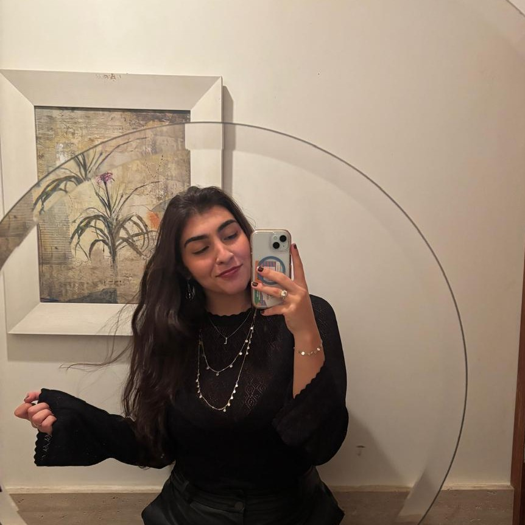

## Born and Raised

I was born and raised in **Rio de Janeiro, Brazil**. At 17,
right after finishing high school, I moved to **São Paulo**,
where I studied Production Engineering and began my professional career.

Rio is a coastal city known for its beaches, warm weather,
and outdoor lifestyle. São Paulo is a large, busy metropolis
with plenty of career opportunities. Unlike Rio, the city
is inland, so there are no beaches in the capital itself!

| Rio de Janeiro | São Paulo |
| :---: | :---: |
| 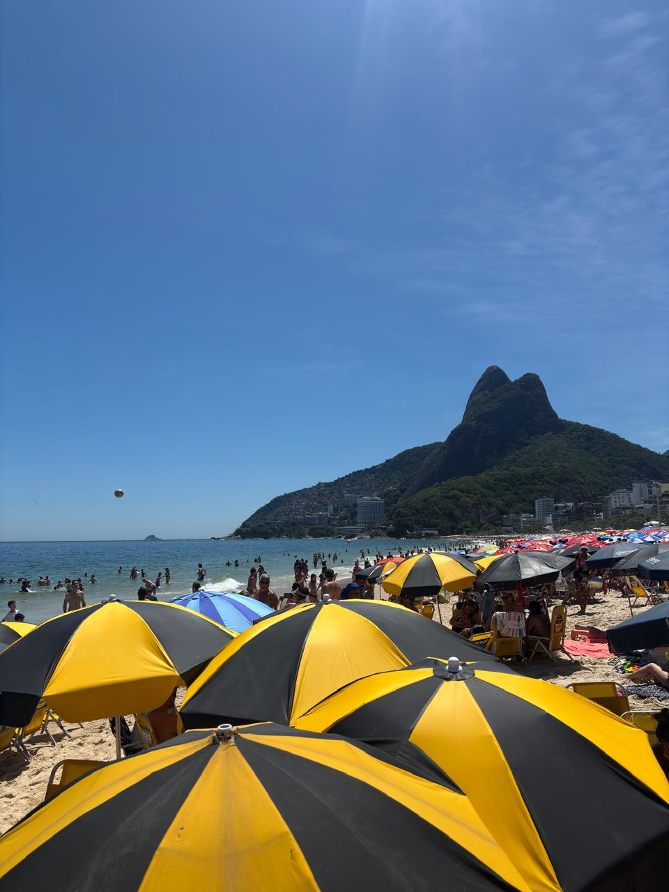 | 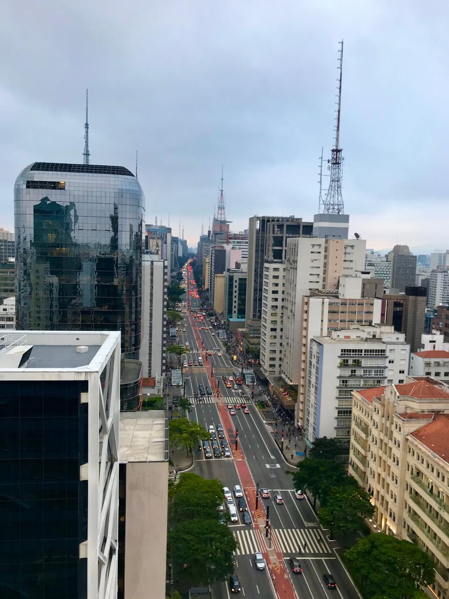 |

Now, I'm excited to begin a new chapter in **Berlin, Germany**.

## Hobbies

When it comes to sports, I love martial arts! I practice
**Jiu-Jitsu and Muay Thai**, and my dad is a black belt,
so martial arts are part of the family.

I also enjoy quieter, creative activities, especially
**making ceramics** and occasionally **painting**.

| Jiu-Jitsu | Muay Thai | Ceramics |
| :---: | :---: | :---: |
| 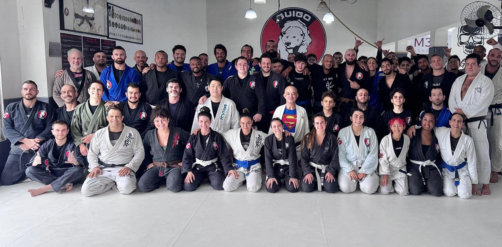 | 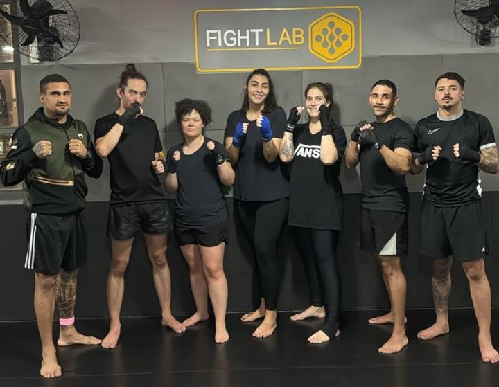 | 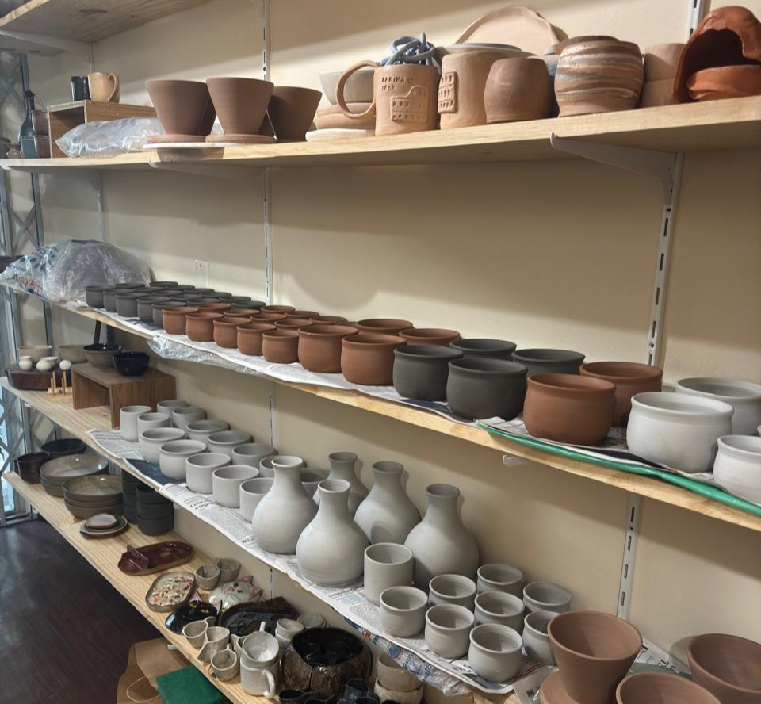 |

Spending time with my **family and friends** is very important
to me. I have a younger sister who is 19, and I already miss her
so much!

| Family |
| :---: |
| 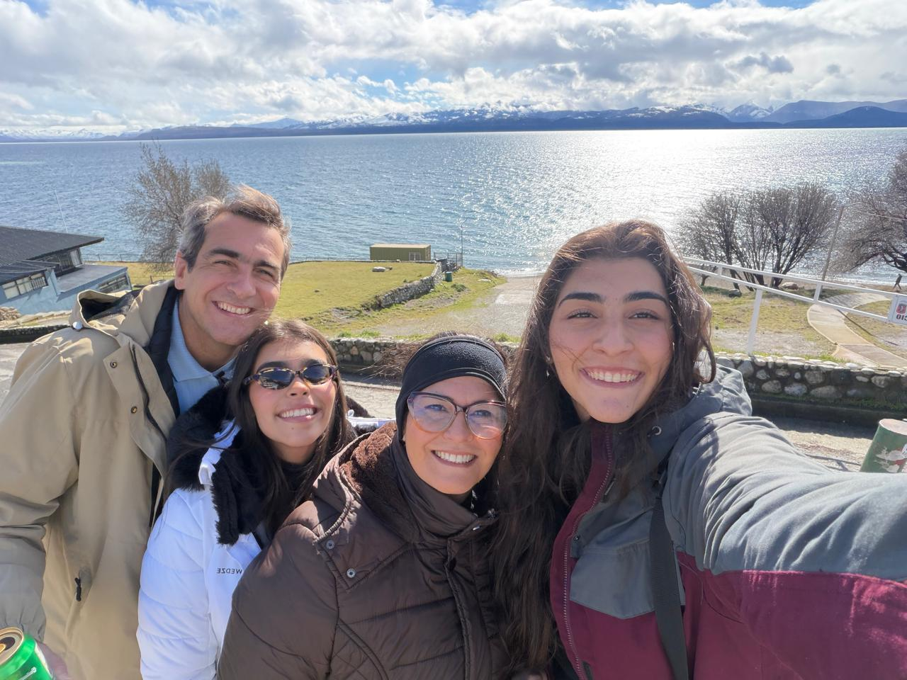 |

## Academic Journey

I studied **Production Engineering at Mackenzie Presbyterian
University** in São Paulo. During my degree, I became interested
in programming, data analysis, and improving business processes.

Alongside my studies, I worked as a **C++ programming tutor**
and received a research scholarship to study how hybrid work
and remote work affect the well-being of students completing
internships.

### 🎓 Stops Along the Way

| Period | Location | Role |
| :--- | :--- | :--- |
| 2020–2025 | São Paulo, Brazil | Bachelor's student in Production Engineering, Mackenzie Presbyterian University |
| Jan–Jul 2024 | Vancouver, Canada | Exchange student in Business Administration and Technology, Kwantlen Polytechnic University |
| Oct 2026–Present | Berlin, Germany | Master's student in Business Intelligence and Process Management, HWR Berlin |

In 2024, I spent a semester in Canada at **Kwantlen Polytechnic
University**. Studying in English and experiencing a different
approach to teaching helped me grow academically, but living
abroad taught me just as much outside the classroom.

I became more independent, made friends from different countries,
and had the chance to explore some beautiful places — including
seeing the northern lights!

| Friends in Canada | Exploring Canada |
| :---: | :---: |
| 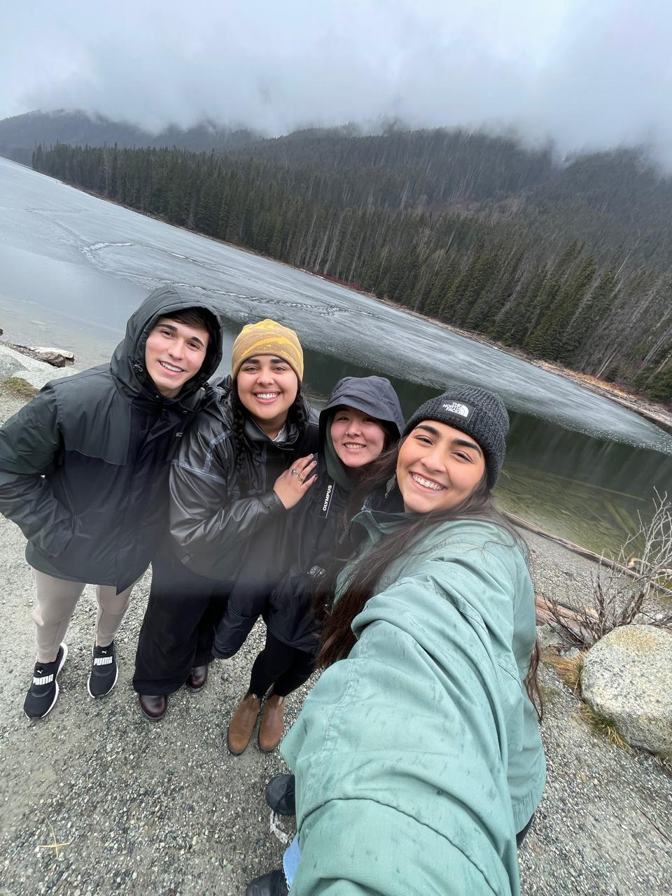 | 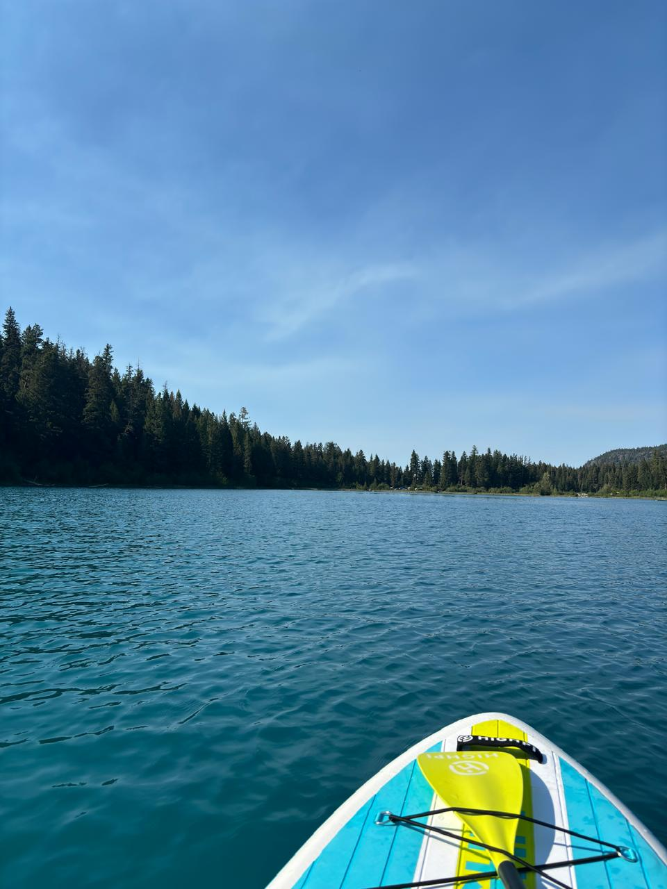 |

| Wildlife | Northern Lights |
| :---: | :---: |
| 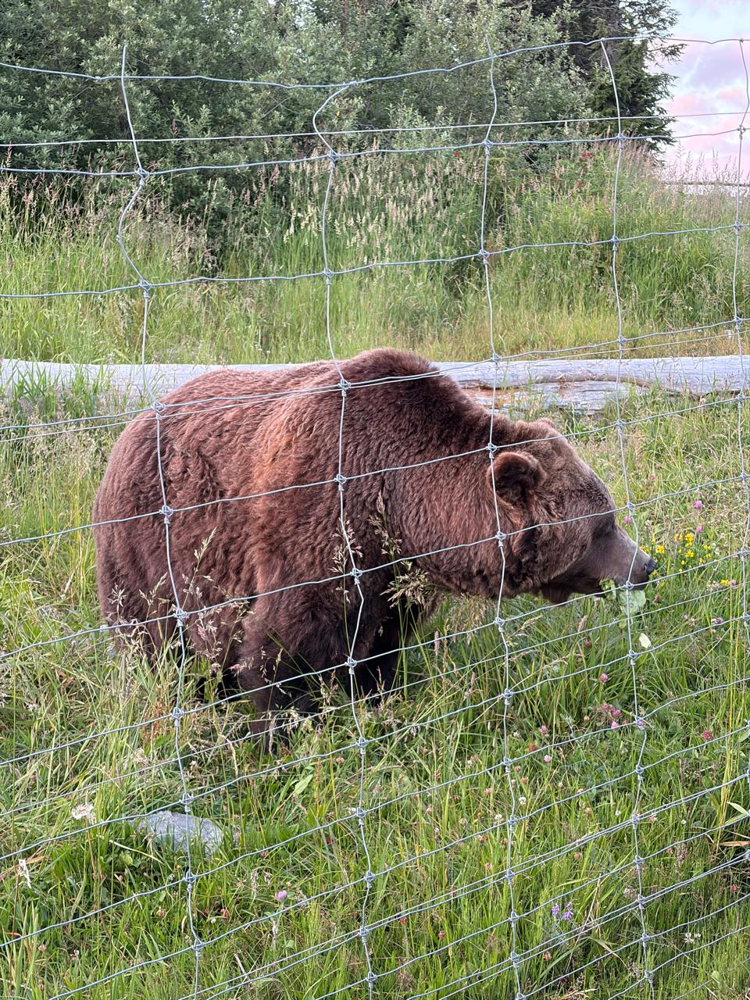 |  |

My master's at HWR is the next step in connecting my experience
with data and automation to a deeper understanding of business
intelligence and process management.

<iframe src="academic_journey_map.html" title="My Academic Journey" width="100%" height="500" style="border:none;"></iframe>

## Professional Experience

My professional journey began at **Raia e Drogasil / RD Saúde**,
a Brazilian pharmacy retail group, where I joined the People
and Culture department as an intern.

I started in **People Planning**, working with invoices,
payments, and administrative processes. As I began using Python
to automate routine tasks, I discovered how much I enjoyed
programming and working with data. I then moved into
**People Analytics**, while still an intern.

I left the company for my exchange semester in Canada and
returned as a **People Analytics Assistant II**. From there,
I progressed to **Junior Analyst** and then **Mid-level Analyst**,
taking on more technical responsibilities and larger projects
within a relatively short period.

### My Career Journey

| Period | Location | Role |
| :--- | :--- | :--- |
| Oct 2022–Dec 2023 | São Paulo, Brazil | Intern at RD Saúde — initially People Planning, then People Analytics |
| Jan–Jul 2024 | Vancouver, Canada | Career break for my exchange semester at Kwantlen Polytechnic University |
| Sep 2024–Jul 2025 | São Paulo, Brazil | People Analytics Assistant II at RD Saúde |
| Jul–Oct 2025 | São Paulo, Brazil | Junior People Analytics Analyst at RD Saúde |
| Oct 2025–Jul 2026 | São Paulo, Brazil | Mid-level People Analytics Analyst at RD Saúde |

My responsibilities grew to include workforce analysis,
dashboard access controls, SQL queries, and support for a
corporate data system migration. I also supported new interns
and helped keep recurring reports and dashboards running
through changes in the team and its systems.

| Work Team |
| :---: |
| 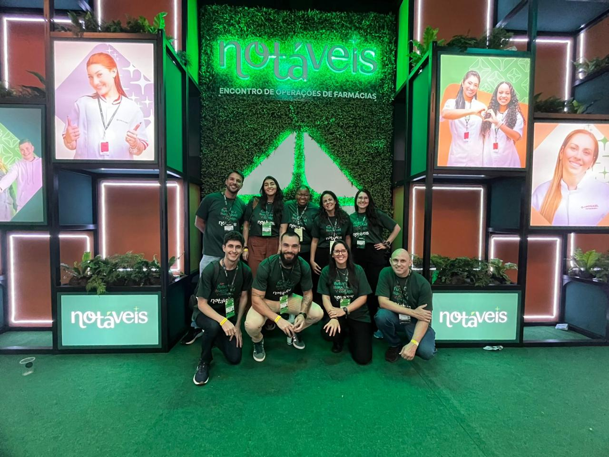 |

## Languages

- **Portuguese** — native
- **English** — advanced
- **German** — currently learning… and occasionally suffering! 😅
